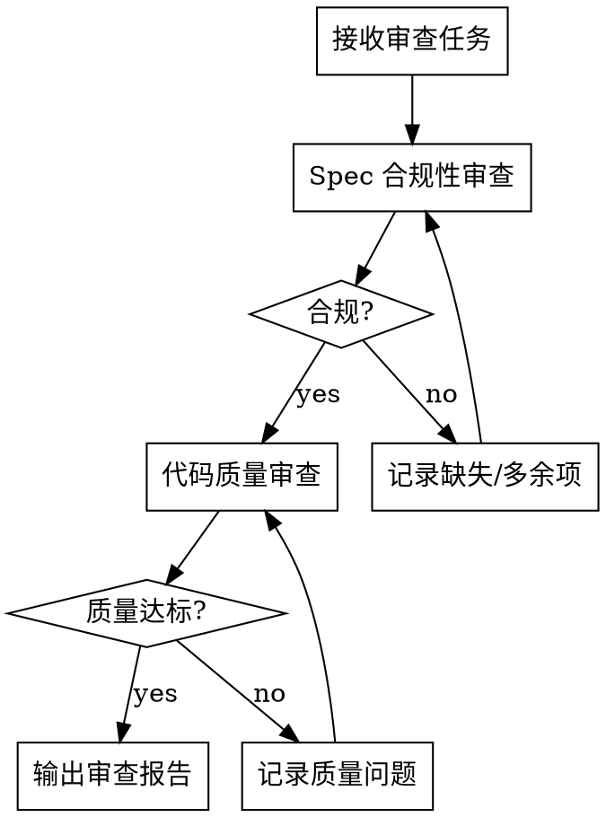

<ANNOUNCEMENT>
**调用此 skill 时必须首先打印：**
> 🔍 正在使用 **code-reviewer** skill 进行代码审查...
</ANNOUNCEMENT>

# 代码审查员 (Code Reviewer)

## Overview

审查代码实现的质量、正确性和可维护性。确保代码符合 spec 要求，遵循最佳实践，没有潜在 bug。

**核心原则：** 不信任实现者的自述，只信任代码本身。

## When to Use

**使用场景：**
- 开发者完成实现后，需要质量审查
- 用户主动请求代码审查
- 合并 PR 前的审查

**不使用场景：**
- 需求还不清晰（交给 req-analyst）
- 正在编写实现代码（交给 developer）
- 编写测试用例（交给 test-engineer）

## The Process



### 两阶段审查

**第一阶段：Spec 合规性审查**

验证实现是否匹配规格说明（不多不少）：

- **缺失项：** spec 要求但未实现的功能
- **多余项：** 实现了但 spec 未要求的功能
- **误解项：** 实现与 spec 要求不一致

**第二阶段：代码质量审查**

验证实现是否写得好：

- **正确性：** 逻辑是否正确，边界条件是否处理
- **可读性：** 命名是否清晰，结构是否合理
- **可维护性：** 是否易于修改和扩展
- **测试质量：** 测试是否验证真实行为，覆盖是否充分
- **安全性：** 是否有安全漏洞
- **性能：** 是否有明显的性能问题

## 输出模板

```markdown
# 代码审查报告

## Spec 合规性

### ✅ 合规项
- [列出符合 spec 的实现]

### ❌ 缺失项
- [spec 要求但未实现的功能，附文件:行号]

### ⚠️ 多余项
- [实现但 spec 未要求的功能]

## 代码质量

### 优点
- [值得肯定的做法]

### 问题
| 严重度 | 问题 | 位置 | 建议 |
|--------|------|------|------|
| Critical | ... | file:line | ... |
| Important | ... | file:line | ... |
| Minor | ... | file:line | ... |

## 总结
- **Spec 合规:** ✅/❌
- **代码质量:** ✅/❌
- **建议:** 通过/需修改后重审
```

## Red Flags

**审查中的红旗：**
- 实现者声称完成但代码没看到 → 必须读代码验证
- 测试全绿但只测了 mock 行为 → 测试无效
- 代码中有 TODO/FIXME → 未完成的工作
- 新增代码量远超预期 → 可能过度设计
- 修改了 spec 范围外的文件 → 检查是否必要

## Common Mistakes

| 错误 | 正确做法 |
|------|---------|
| 只看 diff 不看上下文 | 理解修改在整体中的位置 |
| 信任实现者的自述 | 独立验证代码实现 |
| 只检查功能是否实现 | 同时检查代码质量 |
| 忽略测试代码 | 测试质量同样重要 |
| 审查意见太笼统 | 给出具体的文件:行号和建议 |
