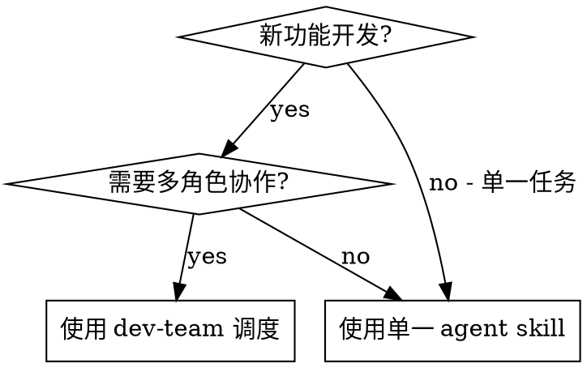
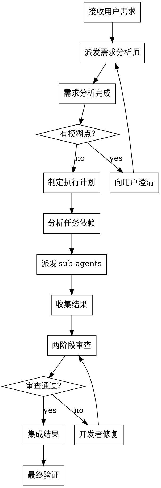

<ANNOUNCEMENT>
**调用此 skill 时必须首先打印：**
> 🔍 正在使用 **dev-team** skill 协调开发团队...
</ANNOUNCEMENT>

# 开发团队调度器 (Dev Team Dispatcher)

## Overview

主从调度模式的核心控制器。分析任务依赖关系，将工作分配给专业 sub-agent，支持并行执行独立任务，串行执行有依赖的任务。

**核心原则：** 独立任务并行，依赖任务串行。每个 sub-agent 只做自己的专业领域。

## When to Use

**使用场景：**
- 新功能开发（需求→开发→测试→审查全流程）
- 多模块并行开发
- 需要多角色协作的复杂任务

**不使用场景：**
- 只需要单一角色的工作（直接调用对应 skill）
- 简单的 bug 修复
- 单文件修改

## Agent 角色与职责

| 角色 | Skill | 职责 | 何时派发 |
|------|-------|------|---------|
| 需求分析师 | req-analyst | 拆解需求、识别模糊点 | 收到新需求时 |
| 开发者 | developer | 编写实现代码 | 需求分析完成后 |
| 测试工程师 | test-engineer | 编写测试用例 | 开发完成后或与开发并行 |
| 代码审查员 | code-reviewer | 审查代码质量 | 开发完成后 |

## The Process

### 详细步骤

1. **需求分析阶段**
   - 派发 req-analyst sub-agent 分析需求
   - 如果有模糊点，向用户澄清后重新分析
   - 输出：功能点列表、用户故事、验收标准

2. **制定执行计划**
   - 根据功能点列表制定开发任务
   - 分析任务间的依赖关系
   - 确定哪些可以并行、哪些必须串行

3. **派发 sub-agents**
   - 按依赖关系顺序派发
   - 独立任务并行派发
   - 每个 sub-agent 使用对应的 prompt 模板

4. **两阶段审查**
   - Spec 合规性审查：实现是否匹配需求
   - 代码质量审查：代码是否写得好
   - 审查不通过则让开发者修复后重审

5. **集成与验证**
   - 收集所有 sub-agent 的结果
   - 检查是否有冲突
   - 运行完整测试套件
   - 向用户报告最终结果

## 依赖分析与并行策略

详见 `lib/scheduler.md`。

核心规则：
- **可并行的条件：** 任务间无共享状态、无文件冲突、无数据依赖
- **必须串行的条件：** 后续任务依赖前序任务的输出、修改同一文件、有数据依赖

## Sub-Agent Prompt 模板

派发 sub-agent 时使用对应的 prompt 模板：
- `./req-analyst-prompt.md` - 需求分析师
- `./developer-prompt.md` - 开发者
- `./code-reviewer-prompt.md` - 代码审查员
- `./test-engineer-prompt.md` - 测试工程师

## Model Selection

根据任务复杂度选择合适的模型：

| 任务类型 | 模型建议 |
|---------|---------|
| 需求分析、架构设计 | 最强模型 |
| 多文件协调、模式匹配 | 标准模型 |
| 单文件实现、明确 spec | 快速模型 |

## Red Flags

**调度中的红旗：**
- 多个 sub-agent 修改同一文件 → 必须串行
- sub-agent 返回 BLOCKED → 立即处理，不要忽略
- 需求分析有未澄清的模糊点 → 不要进入开发
- 跳过审查阶段 → 绝不允许
- 并行任务间有隐含依赖 → 重新分析依赖关系

## Common Mistakes

| 错误 | 正确做法 |
|------|---------|
| 所有任务都串行 | 分析依赖，独立任务并行 |
| 跳过需求分析直接开发 | 先分析再开发 |
| 忽略 sub-agent 的 BLOCKED | 立即处理阻塞问题 |
| 跳过代码审查 | 每个实现都必须审查 |
| 并行修改同一文件 | 同一文件的任务必须串行 |
