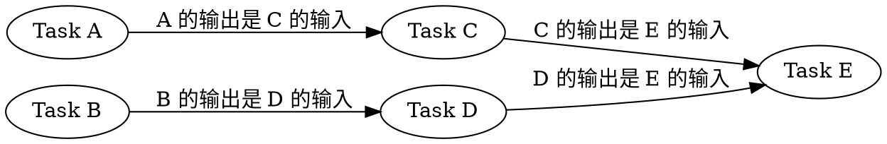
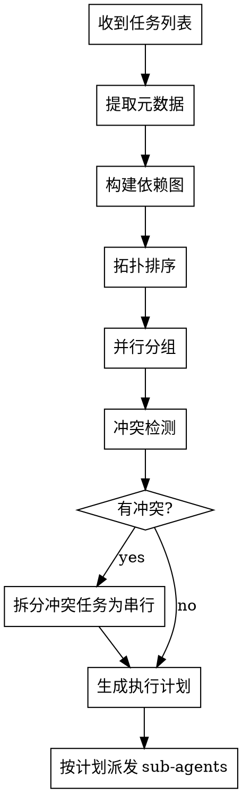

# 调度框架与规则

## 依赖分析算法

### 步骤 1：提取任务元数据

对每个任务提取：
- **输入：** 需要哪些文件/数据作为输入
- **输出：** 会修改/创建哪些文件
- **依赖：** 依赖哪些其他任务的输出

### 步骤 2：构建依赖图



### 步骤 3：拓扑排序 + 并行分组

```
Level 0 (可并行): [Task A, Task B]     ← 无依赖，可同时执行
Level 1 (可并行): [Task C, Task D]     ← 依赖 Level 0，内部可并行
Level 2 (串行):   [Task E]             ← 依赖 Level 1 的多个任务
```

## 并行安全规则

### 可并行的条件（全部满足）

1. **无共享状态：** 任务间不共享可变状态
2. **无文件冲突：** 任务不会修改同一文件
3. **无数据依赖：** 后续任务不依赖前序任务的运行时输出
4. **无资源争用：** 任务不会争用同一资源（端口、数据库连接等）

### 必须串行的条件（任一满足）

1. **数据依赖：** Task B 需要 Task A 的输出作为输入
2. **文件冲突：** Task A 和 Task B 修改同一文件
3. **语义依赖：** Task B 的正确性依赖 Task A 的实现方式
4. **资源争用：** Task A 和 Task B 需要同一独占资源

## 典型依赖模式

### 模式 1：需求→开发→测试→审查（串行流水线）

```
req-analyst → developer → test-engineer → code-reviewer
```

适用：单一功能点，各阶段严格依赖前序输出。

### 模式 2：多模块并行开发

```
req-analyst ─┬→ developer-A → test-engineer-A → code-reviewer-A
             ├→ developer-B → test-engineer-B → code-reviewer-B
             └→ developer-C → test-engineer-C → code-reviewer-C
```

适用：多个独立功能点，可并行开发。

### 模式 3：测试与开发并行

```
req-analyst → developer ──→ code-reviewer
                    └→ test-engineer ──→ code-reviewer
```

适用：开发者写实现，测试工程师同步写测试，最后一起审查。

### 模式 4：混合模式

```
req-analyst ─┬→ developer-A ──→ code-reviewer-A
             ├→ developer-B ──→ code-reviewer-B
             └→ developer-C ──→ code-reviewer-C
                                  ↓
                          test-engineer (集成测试)
                                  ↓
                          code-reviewer (最终审查)
```

适用：多模块并行开发 + 集成测试 + 最终审查。

## 冲突检测

派发并行任务前，必须检查：

1. **文件冲突矩阵**

|  | Task A | Task B | Task C |
|--|--------|--------|--------|
| Task A | - | ✅ 无冲突 | ❌ 同文件 |
| Task B | ✅ 无冲突 | - | ✅ 无冲突 |
| Task C | ❌ 同文件 | ✅ 无冲突 | - |

Task A 和 Task C 有文件冲突 → 必须串行。

2. **数据流检查**

```
Task A 输出: config.json, types.ts
Task B 输入: types.ts
Task C 输入: config.json

→ Task B 和 Task C 都依赖 Task A
→ Task B 和 Task C 之间无依赖 → 可并行
```

## 调度决策流程



## 错误处理

| 场景 | 处理方式 |
|------|---------|
| Sub-agent 返回 BLOCKED | 主 Agent 评估原因，提供更多上下文或拆分任务 |
| Sub-agent 返回 NEEDS_CONTEXT | 提供所需信息后重新派发 |
| 并行任务结果冲突 | 串行修复，先解决冲突再继续 |
| 审查不通过 | 开发者修复后重新审查 |
| 需求分析发现重大遗漏 | 回到需求分析阶段，暂停开发 |
