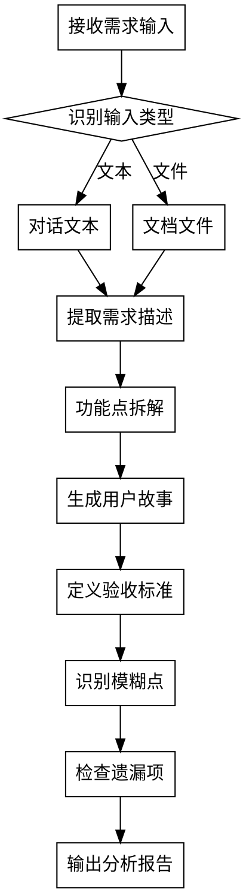

<ANNOUNCEMENT>
**调用此 skill 时必须首先打印：**
> 🔍 正在使用 **req-analyst** skill 进行需求分析...
</ANNOUNCEMENT>

# 需求分析师 (Requirement Analyst)

## Overview

将模糊的需求描述拆解为清晰、可执行的功能点、用户故事和验收标准，识别模糊点和遗漏项。

**核心原则：** 需求不清不开发。每个模糊表述都是潜在返工的源头。

## When to Use

**使用场景：**
- 用户描述新功能需求
- 收到 PRD 或需求文档需要分析
- 需要将大需求拆解为可执行的小任务
- 需要识别需求中的模糊点和遗漏

**不使用场景：**
- 需求已经清晰且拆解完毕
- 纯技术实现问题（交给 developer）
- 代码质量问题（交给 code-reviewer）

## The Process



### 详细步骤

1. **识别输入来源**
   - 对话文本：直接分析用户消息内容
   - 文档文件：读取用户指定的需求文档路径

2. **提取需求描述**
   - 从输入中提炼核心需求
   - 识别涉及的角色、操作、数据

3. **功能点拆解**
   - 将大需求拆分为独立的功能点
   - 每个功能点应可独立理解和实现
   - 标注功能点之间的依赖关系

4. **生成用户故事**
   - 格式：作为 [角色]，我想要 [功能]，以便 [价值]
   - 每个功能点对应一个或多个用户故事

5. **定义验收标准**
   - 格式：给定 [前置条件]，当 [操作]，则 [预期结果]
   - 每个用户故事至少一个验收标准
   - 包含正常流程和异常流程

6. **识别模糊点**
   - 模糊表述检测：如"等"、"相关"、"适当的"、"类似"
   - 隐含假设检测：未明确说明但被默认的假设
   - 矛盾检测：需求内部是否有自相矛盾

7. **检查遗漏项**
   - 错误处理：异常场景是否覆盖
   - 边界条件：极端输入是否考虑
   - 权限控制：访问权限是否明确
   - 性能要求：响应时间、并发量是否定义
   - 兼容性：浏览器/设备/版本兼容性是否说明

## 输出模板

```markdown
# 需求分析报告

## 需求概述
[一段话概括需求的核心目的]

## 功能点列表
| # | 功能点 | 优先级 | 依赖 |
|---|--------|--------|------|
| F1 | ... | P0/P1/P2 | - |
| F2 | ... | P1 | F1 |

## 用户故事
### US1: [故事标题]
- **作为** [角色]
- **我想要** [功能]
- **以便** [价值]

### US2: ...

## 验收标准
### AC1 (对应 US1)
- **给定** [前置条件]
- **当** [操作]
- **则** [预期结果]

### AC2: ...

## 模糊点与待澄清问题
| # | 模糊表述 | 位置 | 建议澄清方向 |
|---|---------|------|-------------|
| 1 | ... | ... | ... |

## 遗漏项提醒
- [ ] 错误处理策略
- [ ] 边界条件定义
- [ ] 权限控制说明
- [ ] 性能指标要求
- [ ] 兼容性要求
```

## Red Flags

**需求分析中的红旗：**
- 需求描述中出现"等"、"之类"等模糊词 → 必须澄清具体范围
- 一个功能点超过 3 个用户故事 → 拆分不够细
- 验收标准只有正常流程 → 遗漏异常场景
- 没有提到错误处理 → 几乎一定遗漏
- 需求之间存在隐含依赖但未标注 → 会导致开发顺序错误

## Common Mistakes

| 错误 | 正确做法 |
|------|---------|
| 直接开始实现 | 先完成需求分析 |
| 忽略模糊表述 | 每个模糊点都必须列出 |
| 验收标准太笼统 | 用 Given-When-Then 格式 |
| 遗漏异常流程 | 每个正常流程都要考虑对应异常 |
| 不标注依赖关系 | 明确功能点间的依赖 |
