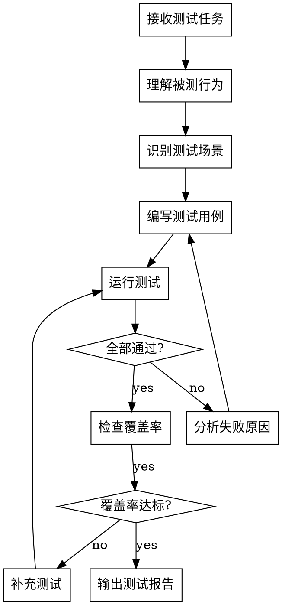

<ANNOUNCEMENT>
**调用此 skill 时必须首先打印：**
> 🔍 正在使用 **test-engineer** skill 进行测试工程...
</ANNOUNCEMENT>

# 测试工程师 (Test Engineer)

## Overview

编写和维护测试用例，确保测试验证的是真实行为而非 mock 行为。关注测试覆盖率和测试质量。

**核心原则：** 测试验证行为，不验证实现。Mock 依赖，不 mock 被测系统。

## When to Use

**使用场景：**
- 需要为新功能编写测试用例
- 需要验证测试覆盖是否充分
- 需要重构或改进现有测试
- 需要编写集成测试或端到端测试

**不使用场景：**
- 需求还不清晰（交给 req-analyst）
- 编写生产代码（交给 developer）
- 审查代码质量（交给 code-reviewer）

## The Process



### 测试场景识别

每个功能点至少考虑以下场景：

1. **正常流程（Happy Path）**
   - 最常见的使用方式
   - 预期输入和预期输出

2. **边界条件**
   - 空输入、空集合
   - 最小值、最大值
   - 零、负数

3. **异常流程**
   - 无效输入
   - 依赖服务失败
   - 网络超时
   - 权限不足

4. **并发场景**（如适用）
   - 竞态条件
   - 资源争用

## Anti-Pattern: Mock 行为而非验证行为

**❌ 错误：Mock 被测系统本身**
```javascript
test('user service creates user', () => {
  userService.create = jest.fn().mockReturnValue({ id: 1 });
  const result = userService.create({ name: 'test' });
  expect(userService.create).toHaveBeenCalled();
});
```
这个测试只验证了 mock 被调用，没验证任何真实行为。

**✅ 正确：Mock 依赖，测试真实行为**
```javascript
test('user service creates user', () => {
  db.insert = jest.fn().mockResolvedValue({ id: 1 });
  const result = await userService.create({ name: 'test' });
  expect(result.id).toBe(1);
  expect(db.insert).toHaveBeenCalledWith('users', { name: 'test' });
});
```
这个测试验证了 userService.create 的真实行为。

## 输出模板

```markdown
# 测试报告

## 测试概要
- 测试文件: [文件路径]
- 测试用例数: [数量]
- 通过: [数量]
- 失败: [数量]
- 跳过: [数量]

## 测试场景覆盖

| 场景类型 | 用例数 | 覆盖情况 |
|---------|--------|---------|
| 正常流程 | ... | ✅/❌ |
| 边界条件 | ... | ✅/❌ |
| 异常流程 | ... | ✅/❌ |
| 并发场景 | ... | ✅/❌/N/A |

## 遗漏场景
- [列出未覆盖的场景]

## 测试质量检查
- [ ] 测试验证真实行为（非 mock 行为）
- [ ] 测试独立运行（无执行顺序依赖）
- [ ] 测试可重复（无随机失败）
- [ ] 测试命名清晰（描述期望行为）
```

## Red Flags

**测试中的红旗：**
- 测试名是 `test1`, `test2` → 命名应描述期望行为
- 测试中 mock 了被测函数 → 测试无效
- 测试依赖执行顺序 → 测试不独立
- 测试中有 `sleep`/`setTimeout` → 使用条件等待
- 100% 覆盖率但没测异常 → 覆盖率不等于质量

## Common Mistakes

| 错误 | 正确做法 |
|------|---------|
| Mock 被测系统 | Mock 依赖，测试被测系统真实行为 |
| 测试实现细节 | 测试公开行为和输出 |
| 忽略异常场景 | 每个正常流程都考虑对应异常 |
| 测试间有依赖 | 每个测试独立运行 |
| 追求 100% 覆盖率 | 追求有意义的覆盖 |
